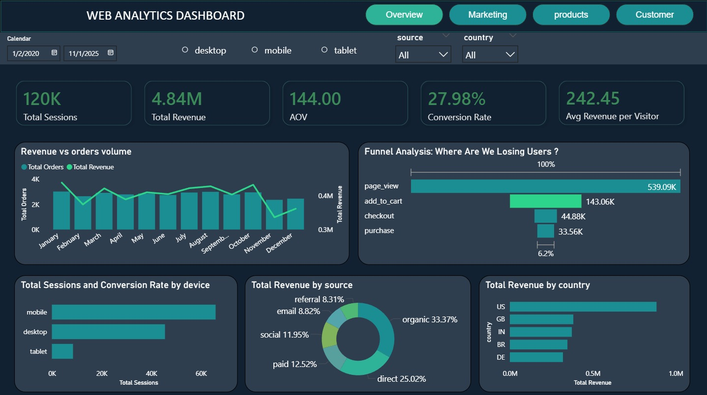
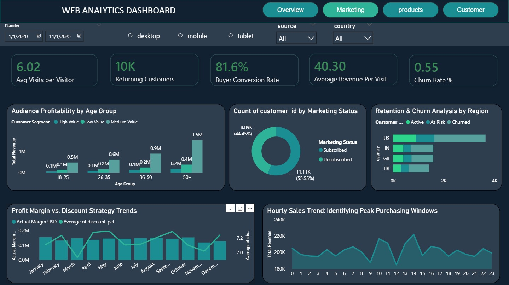
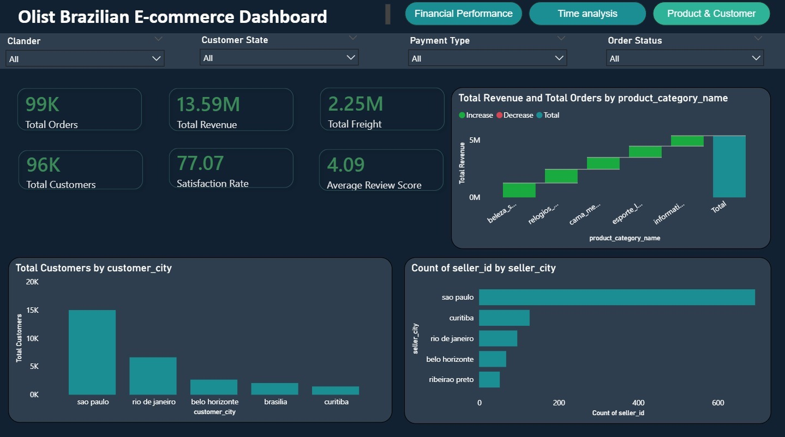
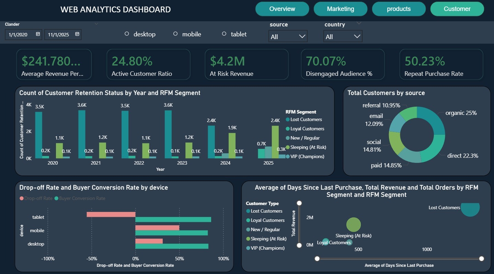

# 📊 Web Analytics Dashboard


> A multi-page Power BI dashboard tracking conversion funnels, audience profitability, RFM segmentation, and customer retention — built on real e-commerce behavioral data from 2020–2025.

---

## 🖼️ Dashboard Preview

### 📌 Overview Page


### 📌 Marketing & Audience Profitability


### 📌 Products & RFM Segmentation


### 📌 Customer Retention & Churn


---

## 📈 Key Metrics

| Metric | Value |
|--------|-------|
| 🖥️ Total Sessions | 120K |
| 💰 Total Revenue | 4.84M |
| 🛒 Conversion Rate | 27.98% |
| 🔁 Repeat Purchase Rate | 50.23% |
| 📉 Churn Rate | 0.53% |
| 👤 Avg Revenue per Visit | $242.45 |
| 👥 Returning Customers | 10K |
| 🛍️ Avg Visits per Visitor | 6.02 |

---

## 🗂️ Dashboard Pages

| Page | Title | Focus |
|------|-------|-------|
| 01 | **Overview** | Sessions, Revenue, AOV, Conversion Rate |
| 02 | **Marketing** | Age Segments, Subscription Gap, Margins |
| 03 | **Products** | RFM Segmentation, Categories, Price Tiers |
| 04 | **Customer** | Retention, Churn, Recovery Analysis |

---

## 🔻 Conversion Funnel

```
Page View     ████████████████████████  539,090  (100%)
Add to Cart   ██████▌                   143,060  (26.5%)
Checkout      ██▏                        44,880  ( 8.3%)
Purchase      █▊                         33,560  ( 6.2%)
```

> ⚠️ **Key Drop-off:** Only 6.2% of page views result in a purchase. The biggest leak occurs between Add to Cart and Checkout.

---

## 🌐 Traffic Sources

| Source | Share | Type |
|--------|-------|------|
| 🔍 Organic Search | 33.37% | Free |
| 🔗 Direct | 25.02% | Free |
| 💳 Paid | 14.85% | Paid |
| 📱 Social | 14.81% | Mixed |
| 🤝 Referral | 8.31% | Free |
| 📧 Email | 8.82% | Owned |

> Organic + Direct account for **58.39%** of traffic — strong brand recognition with low acquisition cost.

---

## 📱 Sessions by Device

| Device | Sessions | Notes |
|--------|----------|-------|
| 📱 Mobile | 18,469 | Dominant platform |
| 🖥️ Desktop | 12,750 | Secondary |
| 📟 Tablet | 2,331 | Lowest share |

> Mobile-first design is critical — mobile drives the majority of sessions.

---

## 👥 RFM Customer Segments

| Segment | Count | Status |
|---------|-------|--------|
| 🔴 Lost Customers | Largest segment | Critical |
| 🟠 Sleeping (At Risk) | 3,440 | At Risk |
| 🟡 New / Regular | 1,350 | Growing |
| 🟢 Loyal Customers | 970 | Healthy |
| ⭐ VIP Champions | 390 (3.8%) | Top Tier |

---

## 🌍 Revenue by Country

| Country | Performance |
|---------|-------------|
| 🇺🇸 United States | Highest Revenue |
| 🇬🇧 United Kingdom | 2nd |
| 🇮🇳 India | 3rd |
| 🇧🇷 Brazil | 4th |
| 🇩🇪 Germany | 5th |

---

## 💡 Key Insights

### 1. 🕳️ The Engagement Gap
539K page views but only **6.2% convert to a purchase**. The checkout-to-purchase drop-off is the single biggest revenue opportunity.

### 2. 📱 Mobile-First Audience
Mobile sessions (18.4K) far outperform desktop (12.7K). The UX must be fully optimized for small screens to capture this majority.

### 3. 💸 $4M Recovery Mission
**67.81% of the audience is disengaged**, with $4M in revenue currently at risk from churned and sleeping customer segments.

### 4. 📧 Untapped Email Channel
Over **55% of customers are unsubscribed** from marketing emails — a massive re-engagement opportunity, especially targeting the high-value 50+ segment.

### 5. 👴 Mature Audience Drives Profit
The **50+ age group contributes 1.5M+** in revenue and should be the primary focus for retention and upsell campaigns.

### 6. 🔁 Strong Repeat Buyers
A **50.23% repeat purchase rate** means once a customer converts, there's a 1-in-2 chance they return — invest in loyalty programs.

---

## 📊 Marketing Highlights

- **Buyer Conversion Rate:** 81.6%
- **Avg Visits per Visitor:** 6.02
- **Subscribed Customers:** 44.45% (8.89K)
- **Unsubscribed Customers:** 55.55% (11.11K)
- **Peak Purchase Hours:** 10AM – 3PM

---

## 🛠️ Tech Stack

| Tool | Purpose |
|------|---------|
| **Power BI Desktop** | Dashboard creation and publishing |
| **DAX** | Custom measures, KPIs, calculated columns |
| **Pandas** | Data transformation |
| **Git** | Version control |

---

## 📁 Repository Structure

```
web-analytics-dashboard/
├── assets/
│   ├── overview.png           # Overview page screenshot
│   ├── marketing.png          # Marketing page screenshot
│   ├── products.png           # Products page screenshot
│   └── customer.png           # Customer page screenshot
├── reports/
│   ├── pbi_web_analytics.pbix # Main Power BI file
│   └── bi_report.pdf          # Exported PDF report
├── data/
│   └── web_analytics_raw.csv  # Source data
├── README.md
└── LICENSE
```

---

## 🚀 Getting Started

### Prerequisites

- [Power BI Desktop](https://powerbi.microsoft.com/desktop/) (free)
  
### Steps

```bash
# 1. Clone the repository
git clone https://github.com/your-username/web-analytics-dashboard
cd web-analytics-dashboard

# 2. Open the Power BI report
# Double-click reports/pbi_web_analytics.pbix
# or on Windows run:
start reports/pbi_web_analytics.pbix

# 3. (Optional) Run data preprocessing
pip install pandas
python data/preprocess.py
```

---

## 📸 How to Add Dashboard Screenshots

1. Open `pbi_web_analytics.pbix` in Power BI Desktop
2. Navigate to each page
3. Press `Windows + Shift + S` to snip the screen
4. Save each image in the `assets/` folder with the names:
   - `assets/overview.png`
   - `assets/marketing.png`
   - `assets/products.png`
   - `assets/customer.png`
5. Push to GitHub — the images will appear automatically in this README

---

## 📋 Data Overview

| Field | Detail |
|-------|--------|
| **Period** | January 2020 – November 2025 |
| **Source** | Web analytics platform export |
| **Dimensions** | Device, Country, Traffic Source, Customer Segment, Age Group |
| **Measures** | Sessions, Revenue, CVR, AOV, Churn Rate, RFM Score |

---

## 📄 License

This project is licensed under the [MIT License](LICENSE).

---

## 🙌 Acknowledgements

Built with ❤️ using **Power BI · DAX**

⭐ **Star this repo if you found it useful!**
